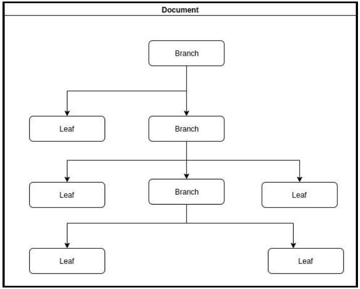

# Tree test

## Sobre o teste

Implemente um _document assembler_ simples com as seguintes características:



1. Cada documento representará uma estrutura de árvore (figura acima) onde
   as folhas terão um campo de texto que poderão ser printados na execução.

2. Cada nó da árvore poderá ser printado de diversas formas (deverá ser
   extensível) sendo que concretamente a forma mais simples será mostrar no
   console os valores das folhas em qualquer tipo de percurso da árvore.

3. Deverá ser estabelecido um mecanismo de monitoramento da execução que
   não influirá no fluxo de execução e só vai oferecer informações sobre o
   componente que está sendo executando. Estas informações poderão ser: tipo
   de componente, profundidade do componente na arvore, horário, entre
   outras. Poderão ser utilizados vários tipos de monitoramento para cada
   componente

### Solução

Foi implementado uma árvore binária, que é uma estrutura de dados que armazena informações de forma hierárquica.

A árvore é composta por nós (Branch) e folhas (Leaf), que são classes que implementam a interface [`IDocumentComponent`](./TreeTest/Domain/Interfaces/IDocumentComponent.cs). A classe [`Branch`](./TreeTest/Domain/Entities/Branch.cs) representa um nó que pode ter filhos, enquanto a classe [`Leaf`](./TreeTest/Domain/Entities/Leaf.cs) representa uma folha com o conteúdo do documento.

A interface [`IDocumentComponent`](./TreeTest/Domain/Interfaces/IDocumentComponent.cs), define os métodos `Accept` e `Print`. O método `Accept` recebe um visitante que implementa a interface [`IMonitor`](./TreeTest/Domain/Interfaces/IMonitor.cs), que define o método `Track`, ou seja, o visitante pode ser usado para percorrer a árvore e monitorar os nós. O método `Print` é usado para imprimir o conteúdo do nó ou folha.

## Tecnologias e conceitos utilizados

O teste foi desenvolvido em C# (dotnet 8) e abrange os princípios SOLID, Clean Code, Clean Architecture e o padrão de projeto Visitor que foi escolhido para monitorar a árvore.

### Estrutura do projeto

O projeto está organizado segundo os princípios da Clean Architecture, com as seguintes camadas:

- **Domain**: Contém as entidades e interfaces relacionadas à árvore e ao monitoramento.
- **Application**: _Camada não implementada neste teste_, mas geralmente conteria casos de uso e lógica de aplicação.
- **Infrastructure**: Contém implementações específicas, como o monitoramento.
- **Presentation**: Contém a interface de usuário, que neste caso é um console simples.

O código possui comentários (summaries) que explicam as partes mais importantes.

## Execução

Como rodar o projeto:

### Docker

Para executar o teste em um contêiner Docker, você pode usar o seguinte comando diretamente na raiz do repositório (onde está localizado o arquivo [`Dockerfile`](./Dockerfile)):

```bash
docker build -t tree-test .
docker run -it --rm tree-test
```

#### Explicação dos comandos

`docker build`: Cria uma imagem Docker a partir do `Dockerfile` localizado no diretório atual.

`-t tree-test .`: Define o nome da imagem como `tree-test` e usa o diretório atual (`.`) como contexto de construção.

`docker run`: Executa um contêiner a partir da imagem criada.

`-it`: Executa o contêiner em modo interativo, permitindo que você veja a saída do console.

`--rm`: Remove o contêiner após a execução, para evitar acumular contêineres parados.

### Dotnet CLI

Para executar o teste usando a CLI do .NET, você pode usar os seguintes comandos (certifique-se de estar na raiz do repositório):

```bash
dotnet build
dotnet run --project TreeTest
```
